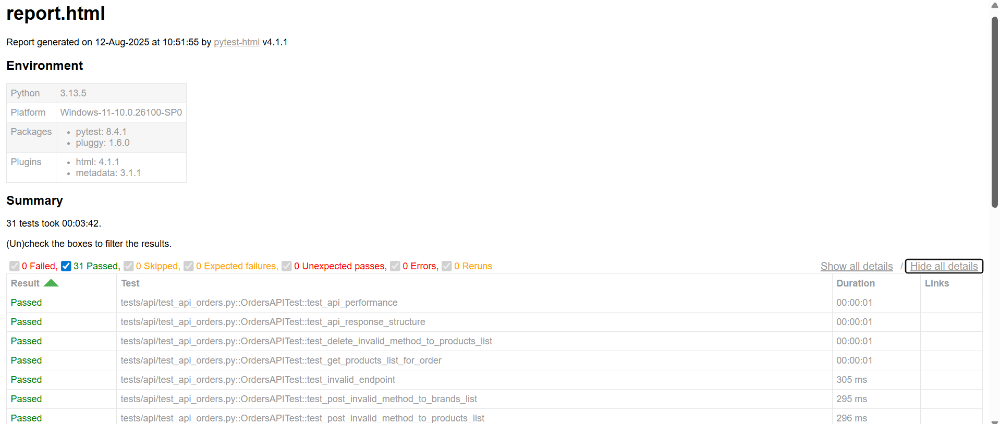
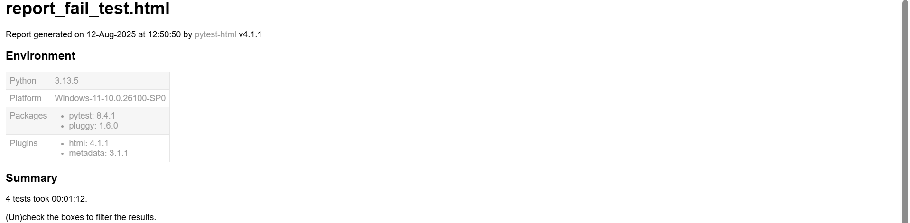
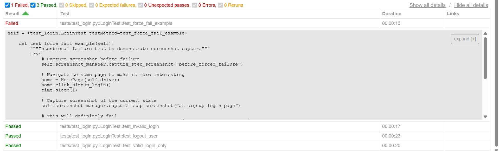
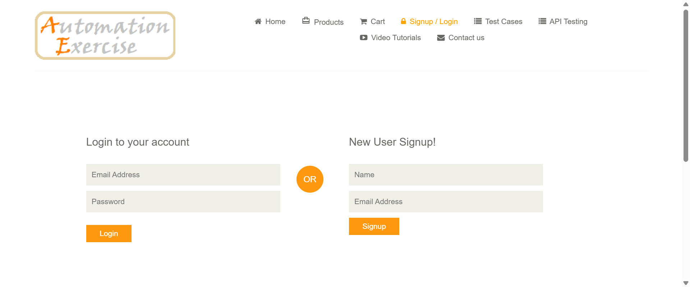

# QA E-commerce Test Automation Framework (UI + API)


A comprehensive test automation framework for e-commerce website testing, built with **Python**, **Selenium**, and **API testing** capabilities. This project demonstrates modern QA practices including **Page Object Model (POM)**, **hybrid testing approach (UI + API)**, and professional reporting.


## 🎯 Project Overview


This framework tests the **automationexercise.com** e-commerce platform, covering critical user journeys and business scenarios that are essential for any e-commerce application.


### ✨ Key Features


- **Hybrid Testing Approach**: Both UI automation (Selenium) and API testing
- **Page Object Model (POM)**: Maintainable and scalable test architecture
- **Cross-browser Support**: Chrome WebDriver with WebDriverManager
- **Professional Reporting**: HTML test reports with detailed results
- **Robust Wait Strategies**: Explicit waits and error handling
- **API Integration Testing**: RESTful API validation alongside UI tests
- **Modular Design**: Reusable components and utilities


## 🔧 Technology Stack


| Category | Technologies |
|----------|-------------|
| **Programming Language** | Python 3.13.5|
| **UI Automation** | Selenium WebDriver |
| **API Testing** | Requests library |
| **Test Framework** | unittest (Python standard library) |
| **Browser Management** | WebDriverManager |
| **Reporting** | pytest-html |
| **Project Management** | Git & GitHub |


## 💻 Test Coverage


### UI Test Scenarios (Selenium WebDriver)
✅ **Authentication & User Management**
- Valid user login and logout functionality
- User registration with complete form validation
- Invalid login scenarios and error handling


✅ **Product & Search Operations**
- Product search functionality with keyword validation
- All products page verification and navigation
- Individual product detail page validation
- Product catalog browsing and filtering


✅ **Shopping Cart & E-commerce Flow**
- Add products to cart functionality
- Product quantity verification in cart
- Cart state persistence and validation


✅ **Order Management & Checkout**
- Complete checkout process with user authentication
- Place order with login-before-checkout flow
- Order form validation and submission


✅ **Customer Support & Communication**
- Contact us form submission and validation
- Form field validation and error messaging


### API Test Scenarios (REST API Testing)
✅ **Product Management APIs**
- GET all products list with structure validation
- GET brands list and data integrity
- Product search with various parameters
- Search functionality with empty and invalid queries
- Case-insensitive search validation
- Non-existent product search handling


✅ **User Account Management APIs**
- User account creation with success scenarios
- Account creation with existing email validation
- User login verification with valid credentials
- Invalid login credentials error handling
- Missing email parameter validation
- Account deletion with valid credentials


✅ **API Security & Performance Testing**
- HTTP method validation (POST/PUT/DELETE on GET endpoints)
- Invalid endpoint handling and error responses
- API response structure validation
- Performance benchmarking and response time analysis
- Parameter validation and edge cases


✅ **Order Management APIs**
- Product list retrieval for order processing
- Invalid HTTP method testing on protected endpoints
- API parameter validation and edge cases


## 🚀 Getting Started


### Prerequisites
- Python 3.7 or higher
- Chrome browser (latest version)
- Git for version control


### Installation


1. **Clone the repository**
   ```bash
   git clone https://github.com/yourusername/qa-ecommerce-test.git
   cd qa-ecommerce-test


2. **Create virtual environment** (recommended)
    ```bash
    python -m venv venv
    source venv/bin/activate  # On Windows: venv\Scripts\activate


3. **Install dependencies**
    ```bash
    pip install -r requirements.txt
    ```
### Running Tests


#### Individual Test Execution
```bash
# Run specific test file
python -m pytest tests/test_login.py -v


# Run API tests
python -m pytest tests/api/test_api_products.py -v


# Run with HTML report
python -m pytest tests/test_cart.py --html=reports/cart_test_report.html --self-contained-html
```
#### Run all tests
```bash
# Run all tests with detailed reporting
pytest --html=reports/report.html --self-contained-html
```


#### Using unittest (alternative)
```bash
# Run individual test
python tests/test_cart.py


# Run all tests in a directory
python -m unittest discover tests/ -v
```


## 📊 Test Reports & Screenshots


### HTML Test Report
After running the test suite, a detailed **HTML report** is generated, showing the status of each test case, execution time, and any error details.


### How to Open the HTML Report
Once the tests have finished running and the HTML report has been generated, you can open it in your browser to review the results.


**Steps:**
1. Navigate to the `reports` folder in your project directory.
2. Locate the file: `report.html`
3. Double-click the file, or open it using your preferred browser:
- **Windows**: Right-click → Open with → Select browser
- **Mac/Linux**: `open reports/report.html` or `xdg-open reports/report.html` from terminal


### HTML Report Screenshot
Below is the HTML test report generated after running the full test suite.


This report shows:
- **31 total test cases executed**
- **All tests passed** ✅ (0 failed)
- **10 UI tests** covering login, registration, product search, cart, checkout, and contact form functionalities
- **21 API tests** covering product management, user account management, order management, and API validation





| Category  | Test Cases | Passed | Failed | Pass Rate |
| --------- | ---------- | ------ | ------ | --------- |
| UI Tests  | 10         | 10     | 0      | 100%      |
| API Tests | 21         | 21     | 0      | 100%      |
| **Total** | **31**     | **31** | **0**  | **100%**  |


### 📸 Example: Screenshot-on-Failure
To demonstrate the **automatic screenshot capture** feature, I created a temporary **fake fail test** in `tests/test_login.py`.  
This test intentionally fails, which triggers the screenshot hook and saves the image to: `reports/screenshots/`


#### The command I executed to produce the fake test failure
```bash
pytest tests/test_login.py --html=reports/report_fail_test.html --self-contained-html -v
```


This will generate:


- **`reports/report_fail_test.html`** → HTML report showing the failed test  
- **`reports/screenshots/PYTEST_FAILURE_<test_name>_<timestamp>.png`** → Automatically captured screenshot at the moment of failure  


---


### 📸 Example of Failure Report & Screenshot
Below is the example of:
1. **Screenshot of `report_fail_test.html`** generated after running the fake failed test.
2. **Screenshot file** (`FAILURE_LoginTest_test_force_fail_example_20250812_124930.png`) which was automatically generated when the test failed.


#### HTML Report with Failure




#### Automatically Captured Screenshot



### 📌 Final Notes
This project is built to deliver **comprehensive, maintainable, and scalable** test coverage for e-commerce applications, integrating both **UI** and **API** testing to ensure end-to-end quality validation.
It is intended as a robust foundation that can be extended to meet evolving business and technical requirements.


Contributions, enhancements, and constructive feedback are welcome to further improve its capabilities and reliability.
